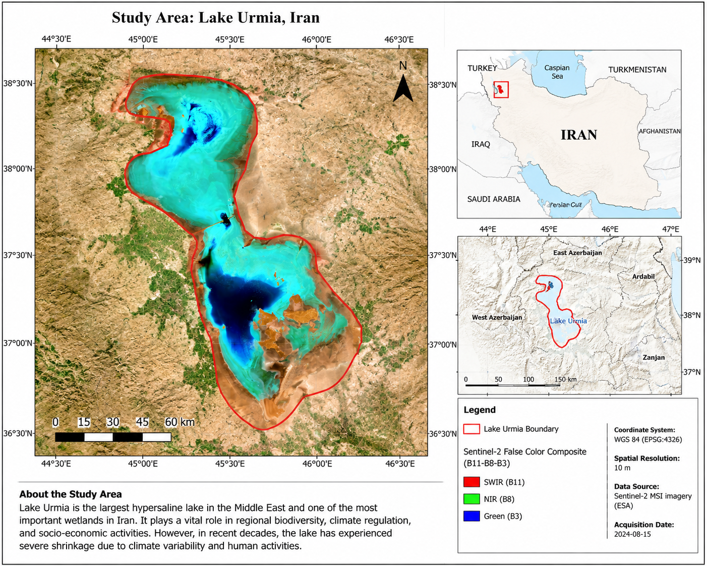
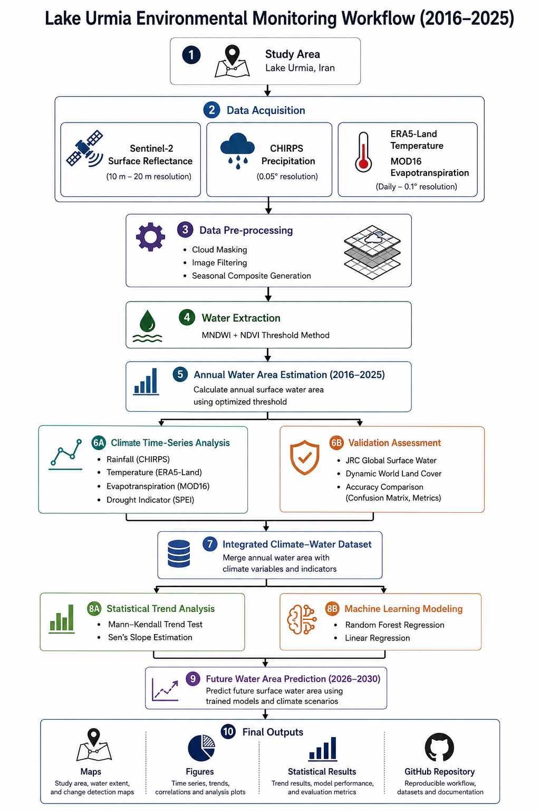

# Lake Urmia Environmental Monitoring (2016–2025)

---

# Overview

Lake Urmia is one of the most important hypersaline lakes in the Middle East and has experienced significant environmental changes during recent decades.

This repository presents a data-driven framework for monitoring and analyzing Lake Urmia environmental dynamics during 2016–2025 by integrating satellite remote sensing, climate datasets, statistical analysis, and machine learning approaches.

The workflow combines Google Earth Engine (GEE) and Python-based analysis to investigate:

- Surface water dynamics
- Climate–water interactions
- Drought impacts
- Environmental trends
- Future water condition scenarios

The main components of this research include:

- Satellite-based surface water extraction using Sentinel-2 MSI imagery
- Climate analysis using precipitation, temperature, evapotranspiration, and drought indicators
- Statistical trend analysis using Mann–Kendall test and Sen's slope estimator
- Machine learning modeling for water area estimation and prediction

The objective is to develop a reproducible and transferable framework for long-term wetland monitoring and climate impact assessment.

---

# Objectives

The main objectives of this project are:

- Monitor annual surface water dynamics of Lake Urmia
- Analyze environmental changes during 2016–2025
- Investigate climate impacts on lake surface variations
- Evaluate drought conditions using SPEI indicators
- Analyze environmental trends using statistical methods
- Develop machine learning models for water area prediction
- Create a reproducible remote sensing workflow for wetland monitoring

---

# Study Area

Lake Urmia is one of the largest hypersaline lakes in the Middle East and an important ecological system in Iran.

During recent decades, the lake has experienced substantial surface water reduction due to climate variability, drought conditions, and anthropogenic pressures.

The study area map was generated using Sentinel-2 MSI imagery and represents the geographical location and environmental characteristics of Lake Urmia.

---

# Data Sources

## Satellite Data

- Sentinel-2 Surface Reflectance
- Dynamic World Land Cover
- JRC Global Surface Water Dataset

## Climate Data

- CHIRPS Precipitation
- ERA5-Land Temperature
- MOD16 Evapotranspiration
- SPEI drought indicators

---

# Methodology

## Google Earth Engine Workflow

Google Earth Engine was used for satellite-based processing:

- Sentinel-2 image acquisition
- Cloud filtering and preprocessing
- Seasonal image compositing
- MNDWI calculation
- NDVI-based masking
- Threshold optimization
- Surface water extraction
- Annual water area estimation
- Validation using independent datasets

---

## Python-Based Analysis

Python was used for environmental analysis and machine learning modeling:

- Data preprocessing
- Climate data integration
- Exploratory Data Analysis (EDA)
- Correlation analysis
- Mann–Kendall trend analysis
- Sen's slope estimation
- Linear Regression modeling
- Random Forest Regression
- Model evaluation
- Future prediction

---

# Research Workflow

The complete workflow integrates satellite remote sensing, climate datasets, statistical analysis, and machine learning approaches to evaluate Lake Urmia environmental dynamics during 2016–2025.

## 1. Satellite Data Acquisition and Pre-processing

- Sentinel-2 MSI image acquisition using Google Earth Engine
- Cloud masking and quality filtering
- Seasonal image preparation
- Generation of analysis-ready satellite datasets

---

## 2. Surface Water Extraction and Validation

- Water extraction using MNDWI and NDVI spectral indices
- Threshold optimization for water classification
- Annual surface water area calculation
- Accuracy assessment using independent datasets:

  - JRC Global Surface Water
  - Dynamic World

---

## 3. Surface Water Dynamics Analysis

- Annual water area estimation (2016–2025)
- Temporal change detection
- Assessment of water loss patterns

---

## 4. Climate Data Integration

Environmental drivers were analyzed using:

- CHIRPS precipitation
- ERA5-Land temperature
- MOD16 evapotranspiration
- SPEI drought indicators

---

## 5. Statistical Trend Analysis

Environmental variables were evaluated using:

- Correlation analysis
- Climate–water relationship assessment
- Mann–Kendall trend test
- Sen's slope estimator

---

## 6. Machine Learning Modeling and Prediction

Predictive models were developed using Python:

- Linear Regression
- Random Forest Regression

Model performance was evaluated using:

- R²
- RMSE
- MAE

The models were used to analyze the relationship between environmental variables and lake water area variations and to generate future water condition scenarios.

---

## 7. Visualization and Reporting

Final outputs include:

- Water area time-series analysis
- Climate trend analysis
- Statistical results
- Model performance evaluation
- Scientific figures and maps

---

# Repository Structure

| Folder | Description |
|--------|-------------|
| `Data` | Climate datasets, water area datasets, and processed tables |
| `Figures` | Scientific figures, maps, and visualization outputs |
| `Results` | Model performance metrics, prediction outputs, and statistical analysis results |
| `Notebook` | Jupyter notebooks for reproducible analysis |
| `README.md` | Project documentation |

---

# Code Availability

This repository provides workflow documentation, processed datasets, scientific figures, and analysis outputs.

The complete processing pipeline will be progressively released as the research framework is further developed.

---
