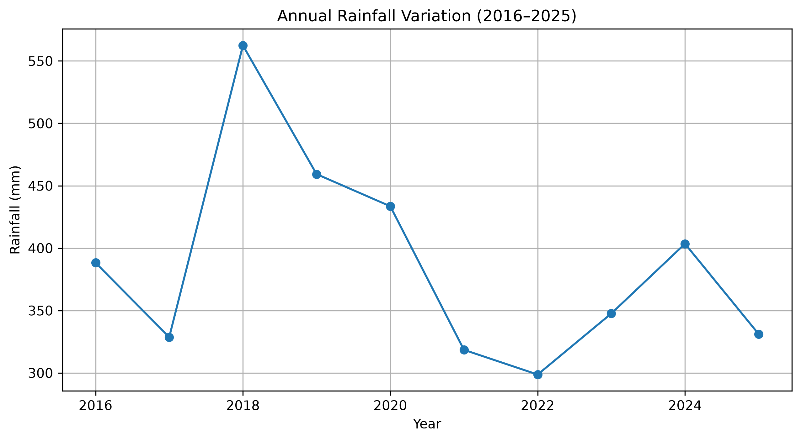
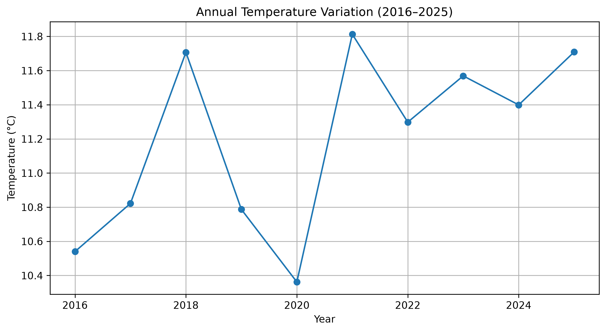
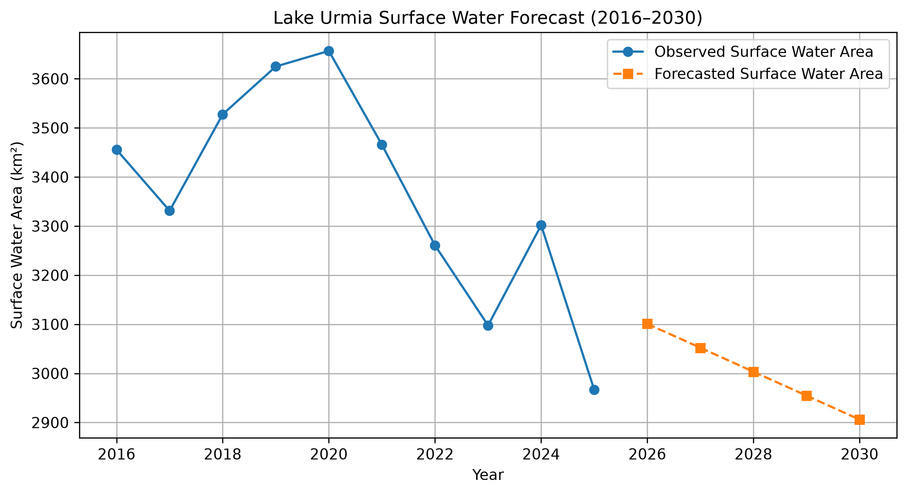

# Lake Urmia Environmental Monitoring (2016–2025)


## Overview

Lake Urmia is one of the most important saline lakes in the Middle East and has experienced significant environmental changes during recent decades.

This repository presents a data-driven framework for monitoring and analyzing Lake Urmia environmental dynamics from 2016 to 2025 by integrating satellite remote sensing, climate datasets, statistical analysis, and machine learning approaches.

The workflow combines Google Earth Engine (GEE) and Python-based analysis to investigate surface water changes, climate–water interactions, drought impacts, and future environmental trends.

The main components of this research include:

- Satellite-based surface water extraction using Sentinel-2 imagery
- Climate data analysis using precipitation, temperature, and evapotranspiration datasets
- Drought assessment using SPEI indicators
- Statistical trend and correlation analysis
- Machine learning modeling for environmental prediction

The objective is to develop a reproducible and transferable workflow for long-term wetland monitoring and climate impact assessment.
---

## Objectives

The main objectives of this project are:

- Monitor annual surface water dynamics
- Analyze long-term environmental changes
- Investigate climate–water relationships
- Evaluate drought conditions using SPEI
- Develop predictive models for future lake conditions
- Build a reproducible workflow for environmental monitoring

---

## Study Area

Lake Urmia is one of the largest hypersaline lakes in the Middle East and has experienced dramatic shrinkage during recent decades due to climate variability and human activities.

---

## Data Sources

### Satellite Data

- Sentinel-2 Surface Reflectance
- Dynamic World
- JRC Global Surface Water

### Climate Data

- CHIRPS Precipitation
- ERA5-Land Temperature
- MOD16 Evapotranspiration

---

## Methodology

### Google Earth Engine

- Image preprocessing
- Cloud masking
- Water extraction using MNDWI
- NDVI masking
- Threshold optimization
- Annual water area calculation
- Change detection
- Validation using Dynamic World and JRC

### Python Analysis

- Data preprocessing
- Exploratory Data Analysis (EDA)
- Correlation analysis
- Linear Regression
- Random Forest Regression
- Model evaluation
- Future prediction

---
## Research Workflow

The complete workflow of this project consists of five main stages:

### 1. Satellite Data Processing

- Sentinel-2 Surface Reflectance data acquisition
- Cloud filtering and preprocessing
- Spectral index calculation (MNDWI and NDVI)
- Surface water extraction

### 2. Water Dynamics Analysis

- Annual surface water area estimation (2016–2025)
- Change detection analysis
- Water loss and gain assessment
- Validation using JRC Global Surface Water and Dynamic World datasets

### 3. Climate Data Integration

Climate variables were integrated to investigate environmental drivers:

- CHIRPS precipitation
- ERA5-Land temperature
- MODIS evapotranspiration
- SPEI drought indicators

### 4. Statistical Analysis

- Trend analysis
- Correlation analysis
- Climate–water relationship assessment

### 5. Machine Learning Modeling

Predictive models were developed using:

- Linear Regression
- Random Forest Regression

Model performance was evaluated using:

- R²
- RMSE
- MAE

## Repository Structure

| Folder | Description |
|--------|-------------|
| `Code/GEE` | Google Earth Engine scripts for satellite image processing and water extraction |
| `Code/Python` | Python scripts for data analysis, visualization, and machine learning |
| `Data` | Climate datasets, water area datasets, and processed tables |
| `Figures` | Scientific figures, maps, and visualization outputs |
| `Results` | Model performance metrics, predictions, and statistical results |
| `Notebook` | Jupyter notebooks for reproducible analysis |
| `README.md` | Project documentation |

## Key Results

The analysis of Lake Urmia environmental dynamics during 2016–2025 revealed significant changes in surface water extent and strong interactions between climate variability and lake conditions.

Main findings include:

- Estimated annual surface water area using Sentinel-2 satellite imagery.
- Detected a decreasing trend in Lake Urmia surface water extent during the study period.
- - Detected a decreasing trend in Lake Urmia surface water extent during the study period.
- Identified relationships between lake surface changes and climate variables including precipitation, temperature, and drought indicators.
- Developed machine learning models to predict lake water area variations.

### Machine Learning Modeling

Two predictive approaches were evaluated:

| Model | R² | RMSE |
|---|---|---|
| Linear Regression | 0.65 | 123.90 |
| Random Forest Regression | 0.93 | 53.90 |

The Random Forest model achieved the best performance, demonstrating the potential of machine learning for environmental prediction and wetland monitoring.

### 5. Machine Learning Modeling

Predictive models were developed using:

- Linear Regression
- Random Forest Regression

Model performance was evaluated using:

- R²
- RMSE
- MAE

---

## Figures

### Surface Water Dynamics (2016–2025)


### Annual Rainfall Variation



### Annual Temperature Variation



### Correlation Heatmap


### Surface Water Forecast (2016–2030)



---

## Repository Structure

| Folder | Description |
|--------|-------------|
| `Code/GEE` | Google Earth Engine scripts for satellite image processing and water extraction |
| `Code/Python` | Python scripts for data analysis, visualization, and machine learning |
| `Data` | Climate datasets, water area datasets, and processed tables |
| `Figures` | Scientific figures, maps, and visualization outputs |
| `Results` | Model performance metrics, predictions, and statistical results |
| `Notebook` | Jupyter notebooks for reproducible analysis |
| `README.md` | Project documentation |


### Validation

Water extraction results were evaluated using independent reference datasets:

- JRC Global Surface Water dataset
- Dynamic World land cover dataset

The validation analysis confirmed the reliability of the satellite-based water mapping approach.

---

## Tools

- Google Earth Engine
- Python
- Pandas
- NumPy
- Matplotlib
- Scikit-learn
- Jupyter Notebook

## Future Research Directions

This project provides a foundation for further environmental monitoring and predictive modeling of Lake Urmia. Future developments will focus on:

### Advanced Trend Analysis

- Mann–Kendall statistical trend test
- Sen's slope estimator
- Long-term change assessment

### Advanced Machine Learning

- XGBoost modeling
- Hyperparameter optimization
- Feature importance analysis
- SHAP-based model interpretation

### Time-Series Forecasting

- Future lake surface water prediction
- Climate scenario analysis
- Long-term environmental forecasting

### Remote Sensing Improvements

- Integration of additional satellite datasets
- Higher-resolution water mapping
- Automated monitoring workflows using Google Earth Engine

### Environmental Applications

- Wetland conservation planning
- Climate impact assessment
- Data-driven water resource management

## Project Status

**Current status:** Active development

This repository represents an ongoing research project focused on environmental monitoring of Lake Urmia using remote sensing, climate data analysis, and machine learning approaches.

Future updates will include additional statistical analyses, improved prediction models, and enhanced visualization outputs.


## Author

**Mojtaba Shakeryari**

M.Sc. Environmental Science  
University of Tehran

Research Interests:

- Remote Sensing
- Geographic Information Systems (GIS)
- Machine Learning
- Climate Change Impacts
- Wetland Monitoring

---

## Citation

If you use this workflow or dataset in your research, please cite this repository:

```bibtex
@misc{shakeryari2026lakeurmia,
  author = {Shakeryari, Mojtaba},
  title = {Lake Urmia Environmental Monitoring Using Remote Sensing and Machine Learning (2016--2025)},
  year = {2026},
  publisher = {GitHub},
   url = {https://github.com/MojtabaShakeryari/Lake-Urmia-Climate-Water-Analysis}
`}`
---
## License

This project is released for academic and research purposes.

Please cite this repository if you use the workflow, methods, or outputs in your research.
