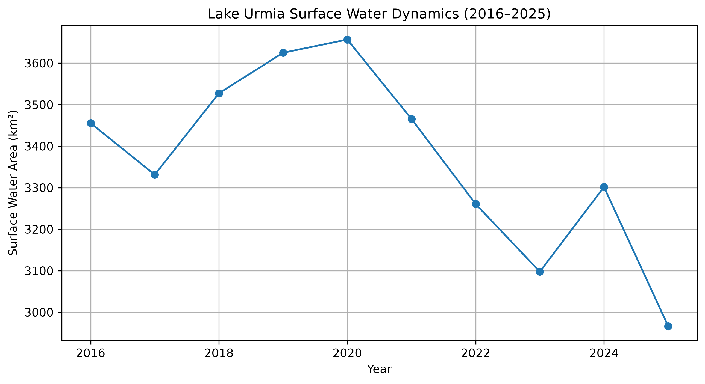
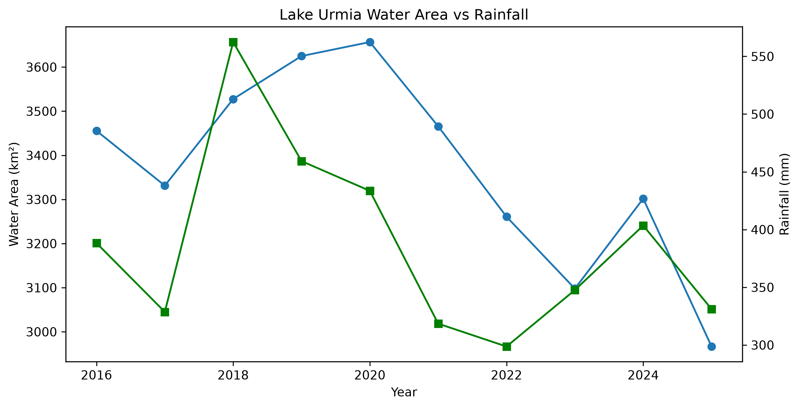
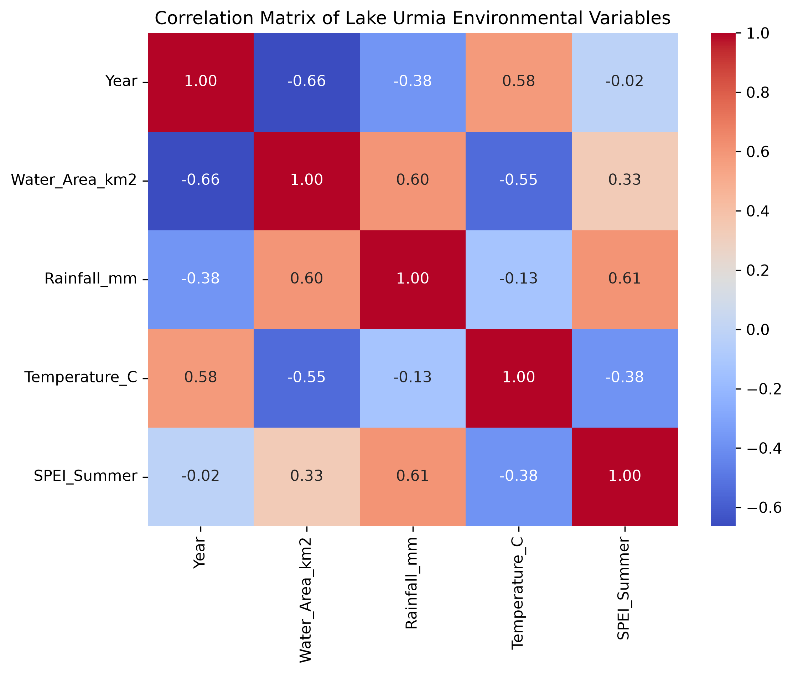

# Lake Urmia Environmental Monitoring (2016–2025)


## Overview

Lake Urmia is one of the most important saline lakes in the Middle East and has experienced significant environmental changes during recent decades.

This repository presents a data-driven framework for monitoring and analyzing Lake Urmia environmental dynamics from 2016 to 2025 by integrating satellite remote sensing, climate datasets, statistical analysis, and machine learning approaches.

The workflow combines Google Earth Engine (GEE) and Python-based analysis to investigate surface water changes, climate–water interactions, drought impacts, and future environmental trends.

The main components of this research include:

- Satellite-based surface water extraction using Sentinel-2 imagery
- Climate data analysis using precipitation, temperature, and evapotranspiration datasets
- Drought assessment using SPEI indicators
- Statistical trend and correlation analysis
- Machine learning modeling for environmental prediction

The objective is to develop a reproducible and transferable workflow for long-term wetland monitoring and climate impact assessment.
---

## Objectives

The main objectives of this project are:

- Monitor annual surface water dynamics
- Analyze long-term environmental changes
- Investigate climate–water relationships
- Evaluate drought conditions using SPEI
- Develop predictive models for future lake conditions
- Build a reproducible workflow for environmental monitoring

---

## Study Area

Lake Urmia is one of the largest hypersaline lakes in the Middle East and has experienced dramatic shrinkage during recent decades due to climate variability and human activities.

---

## Data Sources

### Satellite Data

- Sentinel-2 Surface Reflectance
- Dynamic World
- JRC Global Surface Water

### Climate Data

- CHIRPS Precipitation
- ERA5-Land Temperature
- MOD16 Evapotranspiration

---

## Methodology

### Google Earth Engine

- Image preprocessing
- Cloud masking
- Water extraction using MNDWI
- NDVI masking
- Threshold optimization
- Annual water area calculation
- Change detection
- Validation using Dynamic World and JRC

### Python Analysis

- Data preprocessing
- Exploratory Data Analysis (EDA)
- Correlation analysis
- Linear Regression
- Random Forest Regression
- Model evaluation
- Future prediction

---

## Repository Structure

The repository is organized as follows:
Lake-Urmia-Climate-Water-Analysis/
│
├── Code/
│ ├── GEE/
│ │ └── Google Earth Engine scripts for satellite processing
│ │
│ └── Python/
│ └── Data analysis, visualization, and machine learning models
│
├── Data/
│ ├── Climate datasets
│ ├── Water area datasets
│ └── Processed analysis tables
│
├── Figures/
│ └── Generated maps and scientific visualizations
│
├── Results/
│ ├── Model performance metrics
│ ├── Prediction outputs
│ └── Statistical analysis results
│
├── Notebook/
│ └── Jupyter notebooks for reproducible analysis
│
└── README.md
---

## Key Results

The analysis of Lake Urmia environmental dynamics during 2016–2025 revealed significant changes in surface water extent and strong interactions between climate variability and lake conditions.

Main findings include:

- Estimated annual surface water area using Sentinel-2 satellite imagery.
- Detected a decreasing trend in Lake Urmia surface water extent during the study period.
- Calculated an average annual water loss rate of approximately **48.7 km²/year**.
- Identified relationships between lake surface changes and climate variables including precipitation, temperature, and drought indicators.
- Developed machine learning models to predict lake water area variations.

## Visual Results

### Lake Urmia Surface Water Dynamics (2016–2025)



---

### Relationship Between Lake Surface Water and Rainfall



---

### Environmental Variables Correlation Analysis




### Machine Learning Performance

Two predictive approaches were evaluated:

| Model | R² | RMSE |
|---|---|---|
| Linear Regression | 0.65 | 123.90 |
| Random Forest Regression | 0.93 | 53.90 |

The Random Forest model achieved the best performance, demonstrating the potential of machine learning for environmental prediction and wetland monitoring.

### Validation

Water extraction results were evaluated using independent reference datasets:

- JRC Global Surface Water dataset
- Dynamic World land cover dataset

The validation analysis confirmed the reliability of the satellite-based water mapping approach.

---

## Tools

- Google Earth Engine
- Python
- Pandas
- NumPy
- Matplotlib
- Scikit-learn
- Jupyter Notebook

---

## Future Improvements

Planned future developments include:

- Mann–Kendall Trend Analysis
- Sen's Slope Estimator
- Time-series forecasting
- XGBoost modeling
- SHAP feature importance
- Interactive visualization dashboard

---

## Author

**Mojtaba Shakeryari**

M.Sc. Environmental Science  
University of Tehran

Research Interests:

- Remote Sensing
- Geographic Information Systems (GIS)
- Machine Learning
- Climate Change Impacts
- Wetland Monitoring

---

## Citation

If you use this workflow or dataset in your research, please cite this repository:

```bibtex
@misc{shakeryari2026lakeurmia,
  author = {Shakeryari, Mojtaba},
  title = {Lake Urmia Environmental Monitoring Using Remote Sensing and Machine Learning (2016--2025)},
  year = {2026},
  publisher = {GitHub},
   url = {https://github.com/MojtabaShakeryari/Lake-Urmia-Climate-Water-Analysis}
}
---

## License

This repository is intended for academic and research purposes.
